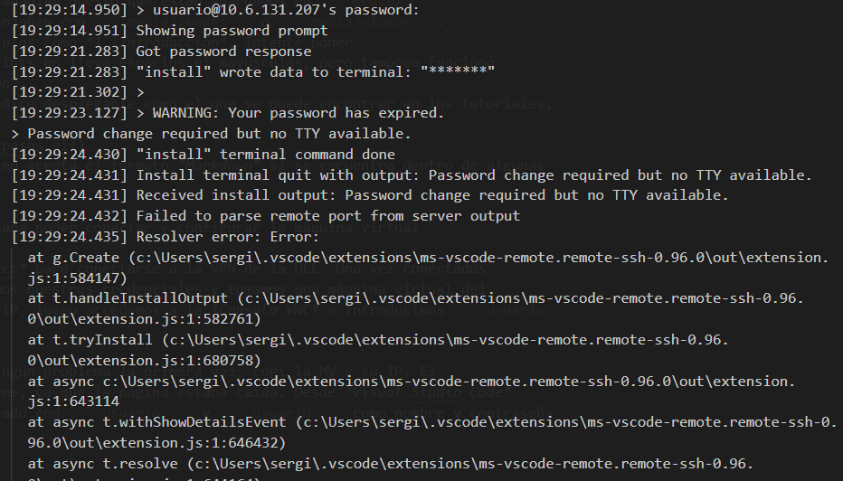

# Índice
[Introducción](#introducción)

[Conexión y configuración de la máquina virtual](#conexión-y-configuración-de-la-máquina-virtual)
  * [Tomar la máquina virtual del pool y SSH](#tomar-la-máquina-virtual-del-pool-y-ssh)
  * [Modificación del nombre del host, la MV y actualización de la misma](#modificación-del-nombre-de-la-mv-y-actualización-de-la-misma)

[Modificación del nombre de host en máquina local](#modificación-del-nombre-de-host-en-máquina-local)

[Creación de clave pública-privada](#creación-de-clave-pública-privada)
 * [Máquina local](#máquina-local)
 * [Máquina virtual](#máquina-virtual)

# Introducción
En este informe se detallarán los pasos a seguir para llevar a cabo la configuración e instalación de la 
máquina virtual de la asignatura.

# Pasos previos 
Para realizar esta práctica es necesario tener conocimientos básicos de *GitHub Skills* y *Jekyll*. Para ello 
seguí los tutoriales facilitados por el profesorado:
* [Introduction to GitHub](https://github.com/skills/introduction-to-github)
* [Communicate using Markdown](https://github.com/skills/communicate-using-markdown)
* [GitHub Pages](https://github.com/skills/github-pages)

A la hora de seguir estos tutoriales me encontré con varios problemas:
* Hasta que no pude clonar el repositorio en la máquina virtual tuve que crear un repositorio personal para 
poder ir documentando a medida que iba realizando la práctica.
* Las imágenes y los vídeos de este informe no se añadían puesto que están guardados en ``` media/ ```. 
Para solucionarlo simplemente concreté donde se alojaban con ``` media/images``` o ``` media/videos```.
* Para hacer el índice no me fue posible poner títulos como *1. Introducción*. Intenté poner 
*1.-introducción* debido a que el formato de los links no lleva espacios ni mayúsculas, pero tampoco funcionó.
Así que opté por solo poner el título *Introducción*.
* Quería lograr en el archivo ```index.md``` un índice desplegable como el que se puede encontrar en los tutoriales, 
concretamente, en el *README.MD*.


Pero esto me fue imposible. Por lo visto *Jekyll* no acepta el formato *Markdown* si se encuentra dentro de algunas
etiquetas de *HTML* como ``` <details>```.

# Conexión y configuración de la máquina virtual
Ahora procederemos a detallar los pasos seguidos para poder conectar y configurar la máquina virtual
### Tomar la máquina virtual del pool y SSH
Lo primero es tener instalada la VPN *Global Protect* para conectarse a la VPN de la ULL. Una vez conectados
accedemos a [iaas.ull.es](iaas.ull.es), introducimos nuestras credenciales y tomamos una máquina virtual del
pool. Cuando la máquina esté operativa tomamos su IP, luego accedemos a la *Consola VNC* e introducimos ``` usuario ```
y ``` usuario ``` como nombre y contraseña.

Al entrar en [iaas.ull.es](iaas.ull.es) no tuve ningún problema la primera vez, cogí la MV y su correspondiente IP. El
problema surge la segunda vez que intenté conectarme, ya que la página estaba caída. Desde *Visual Studio Code* 
pretendí hacer un *SHH* pero al no haberme registrado con ``` usuario ``` y ``` usuario ``` y puesto una nueva 
contraseña no me dejaba hacer *SSH*

Como podemos ver en la imagen conecta correctamente, pero a la hora de solicitar el cambio de contraseña se 
pueden apreciar los errores, sobretodo el error ```[19:29:24.435] Resolver error: failed```.
Una vez arreglado el acceso a la página ya pude entrar y hacer un SSH desde *Visual Studio Code* desde la extensión oficial [Remote-SSH](https://marketplace.visualstudio.com/items?itemName=ms-vscode-remote.remote-ssh) poniendo ```ssh usuario@10.6.131.207```

## Modificación del nombre de la MV y actualización de la misma
Como podemos ver en el prompt: ```usuario@ubuntu:~$``` tenemos como nombre de la máquina ubuntu. 
Dentro del archivo ```hostname``` alojado en ```/etc/hostname``` está especificado el nombre del host, por lo tanto
procederemos a cambiarlo mediante los siguientes pasos:
* 
```bash
usuario@ubuntu:~$ cat /etc/hostname
ubuntu
```

Con este comando comprobamos dentro del archivo ```hostname``` que el nombre es *ubuntu* como mencionamos 
anteriormente. Acto seguido hacemos uso del comando ```sudo vi /etc/hostname``` para editar el fichero. Al 
hacerlo nos debería aparecer lo siguiente:
```
ubuntu
~                                                                                                                                                                                                        
~                                
1,5           All
```
Simplemente le damos a la tecla i y pasamos a modo insertar, una vez cambié el nombre por ```dsi2223```. De 
esta manera el archivo queda de la siguiente manera:
```
dsi2223
~                                                                                                                                                                                                        
~                                                                                                                                                                                         
"/etc/hostname" 1L, 8C                                                                                                                                                                 1,7           All
```
Para guardar el archivo pulsamos la tecla ```esc```, escribimos ```:wq``` y pulsamos enter.
Una vez realizado esto procedemos a hacer ```usuario@dsi2223:~$ sudo reboot``` y la actualizamos con ```usuario@dsi2223:~$ sudo apt update``` 
y ```usuario@dsi2223:~$ sudo apt upgrade``` y reiniciamos otra vez con ```usuario@dsi2223:~$ sudo reboot```

# Modificación del nombre de host en máquina local
Ya cuando la máquina se reinicie tendremos que editar el archivo de *VSC* que se encarga de hacer el
SSH. Para esto, tenemos que conectarnos dando click a la extensión y, en vez de seleccionar la IP de la máquina,
seleccionamos ```Configure SSH Hosts...``` 

Una vez dentro le damos click al archivo ```.../config``` y debería aparecer lo siguiente:
```
Host 10.6.131.207
  HostName 10.6.131.207
  User usuario
```
Simplemente tenemos que cambiar donde pone ``` Host 10.6.131.207``` por ``` Host DSI ``` y lo guardamos

Si lo queremos hacer vía terminal, en mi caso PowerShell, tendríamos que seguir estos pasos:
* Pulsamos ``` Win + R ``` y nos saldrá lo siguiente


* Pulsamos enter y se nos abrirá esta pestaña


* Ahora editamos el archivo ``` hosts``` y ponemos al final del todo la IP de la máquina y su alias ``` 10.6.131.207 DSI``` 
y lo guardamos

* Cuando queramos hacer SSH por terminal, hacemos:

```bash
PS C:\Users\sergi> ssh usuario@DSI
usuario@10.6.131.207's password:
Welcome to Ubuntu 20.04.3 LTS (GNU/Linux 5.4.0-137-generic x86_64)
 * Documentation:  https://help.ubuntu.com
 * Management:     https://landscape.canonical.com
 * Support:        https://ubuntu.com/advantage
  System information as of Mon Feb  6 10:37:21 UTC 2023  
  .
  .
  .
  .
usuario@dsi2223:~$
```

También podemos reducir ```ssh usuario@DSI ``` a ```ssh dsi ```. Como configuramos anteriormente el
archivo ``` .../config``` en *VSC* se habrá puesto automáticamente como:
```
Host DSI
  HostName 10.6.131.207
  User usuario
```

Pero si lo queremos cambiar manualmente añadimos debajo, hacemos ```Win+r``` ponemos:


Y modificamos el archivo ```config```
```
Host DSI
  HostName 10.6.131.207
  User usuario
Host dsi
  HostName 10.6.131.207
  User usuario
```


# Creación de clave pública-privada
## Máquina local
Estando en la **máquina local**, en mi caso *Windows* abrimos la *PowerShell*. 
Escribimos ```ssh-keygen``` y se generará una clave, esta la tendremos que copiar
en la máquina virtual, con el siguiente comando en la **máquina local**: ```type $env:USERPROFILE\.ssh\id_rsa.pub | ssh usuario@dsi "cat >> .ssh/authorized_keys" ``` y presionamos enter. Ahora puede suceder algo muy común y es que salga un error de que 
no existe ``` .ssh/authorized_keys```. Lo solucioné, estando en la **máquina virtual**  con:
```bash
usuario@dsi2223:~$ mkdir .ssh/
usuario@dsi2223:~$ chmod 700 .ssh/
usuario@dsi2223:~$ touch .ssh/authorized_keys
```
Comprobamos que ya no solicita la contraseña
```bash
PS C:\Users\sergi> ssh usuario@DSI
Welcome to Ubuntu 20.04.3 LTS (GNU/Linux 5.4.0-137-generic x86_64)
 * Documentation:  https://help.ubuntu.com
 * Management:     https://landscape.canonical.com
 * Support:        https://ubuntu.com/advantage
  System information as of Mon Feb  6 10:37:21 UTC 2023  
  .
  .
  .
  .
usuario@dsi2223:~$
```
## Máquina virtual
Con los pasos anteriores ya tendríamos la parte de la **máquina local** configurada. A continuación
pasamos a configurar la parte de la **máquina virtual**:

```bash
usuario@dsi2223:~$ ssh-keygen
Generating public/private rsa key pair.
Enter file in which to save the key (/home/usuario/.ssh/id_rsa): 
Enter passphrase (empty for no passphrase): 
Enter same passphrase again: 
Your identification has been saved in /home/usuario/.ssh/id_rsa
Your public key has been saved in /home/usuario/.ssh/id_rsa.pub
The key fingerprint is:
SHA256:xCAjegk/IzLjyz7kbZzmh+GKJ+XvsmR8TrwcP9x5l1s usuario@dsi2223
The key's randomart image is:
+---[RSA 3072]----+
|. . o .          |
| + o o o         |
|* *     o        |
|o= o   .         |
| .      S        |
|.ooo             |
|o=B O. . .   .E  |
|+=+& =o o . o.   |
|.=B*B .. . ...   |
+----[SHA256]-----+
usuario@dsi2223:~$ ssh-copy-id usuario@máquina_local
```

# Instalación de git y Node.js
## Instalación y configuración de git
### Instalación
Procedemos a instalar de la siguiente manera:
```bash
usuario@dsi2223:~$ sudo apt install git
[sudo] password for usuario: 
Reading package lists... Done
Building dependency tree       
Reading state information... Done
git is already the newest version (1:2.25.1-1ubuntu3.8).
git set to manually installed.
The following packages were automatically installed and are no longer required:
  libfwupdplugin1 libxmlb1
Use 'sudo apt autoremove' to remove them.
0 upgraded, 0 newly installed, 0 to remove and 0 not upgraded.
usuario@dsi2223:~$ 
```
### Configuración
Tendremos que configurar nuestras credenciales en git, por lo tanto:
```bash
usuario@dsi2223:~$ git config --global user.name "SergioPerera"
usuario@dsi2223:~$ git config --global user.email alu0101394503@ull.edu.es
usuario@dsi2223:~$ git config --list
user.name=SergioPerera
user.email=alu0101394503@ull.edu.es
usuario@dsi2223:~$ 
```

